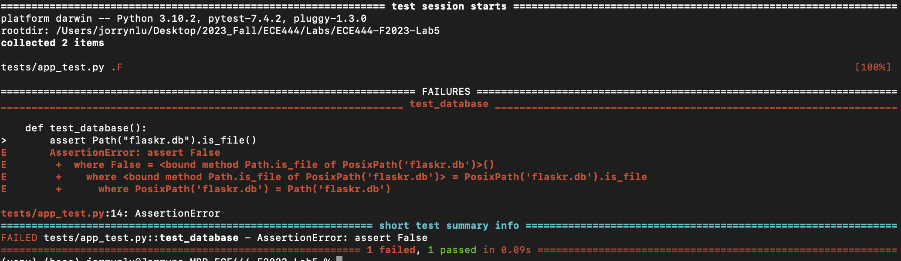

# Jorryn Lu
ECE444 Fall 2023 Lab 5 - Test-Driven Development

This repo references https://github.com/mjhea0/flaskr-tdd

## Table of Contents
* [Part 2 - Group Project Test Cases](#group-project-test-cases)
* [Part 3 - Pros and Cons of TDD](#pros-and-cons-of-test-driven-development)
    * [Pros](#pros)
    * [Cons](#cons)
* [Part 1 - Flaskr Example Activity Log](#flaskr-example-activity-log)

## Group Project Test Cases
[lujorryn: User Authentication Tests](https://github.com/ECE444-2023Fall/project-1-web-application-design-group5-frog/pull/31/files#diff-358bdbff230a75c02aa9882db61fdd945fc62aa35dd54881f8f13a2c6798ea4cR35-R95) Implement tests for login,signup and logout

[lujorryn: Event Browse Page Test](https://github.com/ECE444-2023Fall/project-1-web-application-design-group5-frog/pull/31/files#diff-358bdbff230a75c02aa9882db61fdd945fc62aa35dd54881f8f13a2c6798ea4cR117-R124) Implement test for the events browsing page

## Pros and Cons of Test-Driven Development
### Pros
The test-based nature of TDD provides many benefits:
- **Higher code quality**: Because tests are written before the actual code, it ensures that developers need to provide robust and less error-prone code that meets the tests' requirements.
- **Higher modularity thus easier to maintain**: TDD consists of tests that only consider one microfeature at a time, which makes it easier to develop into a modular system that has a clear interface. And because each of these features are decoupled from each other, it is easier to change the implementation of a single feature without worrying about breaking other parts of the system.
- **Better collaboration**: Because each test in TDD only concerns a certain set of features, it makes collaboration between development and QA easier as each feature can be tested and developed separately.
- **Earlier bug detection**: TDD identifies bugs early in the development process and forces developers to fix them before they can move on. This makes debugging less time-consuming since they are caught and eliminated in the early cycle of development.
- **Ensures concise code**: Since the tests are decided before implementing anything, developers will only write code that are needed to pass the tests, which already covers all of the desired funcionality. This can minimize the amount of useless code that have low contribution to features in the codebase.
- **Easier to refactor**: The existing test suite serves as a good benchmark for any refactoring changes that the developer wants to implement. Even if the developer does not understand how the entire system is integrated, if the refactored code still passes all the tests, that means the system is still good to go.
- **Tests document the code**: Each test in the test suite showcases how the code is supposed to be used, which serves as a valid documentation of the codebase.

### Cons
Although TDD provides many benefits, it also has some weaknesses:
- **Steep learning curve**: TDD is closely related to the structure and planning of code, so everyone on the team needs to be able to understand how it works and implement tests effectively. This can be challenging to developers that are not familiar with this concept because striking the balance between writing tests and writing code comes with a lot of experience.
- **Incomplete test coverage**: The tests involved in TDD already have a set of scenarios that they intend to test. However, there is no way for the tests to cover every possible scenario, so end-users/clients may still encounter bugs due to incomplete test coverage.
- **Time consuming**: An extensive planning time is required for TDD. Developers will need a holistic view of the entire system, write test code of all components that you wish to test and ensure them failing before they can start actually implementing the features.
- **Higher maintenance overhead**: When maintaining the code base, not only do developers need to maintain the actual code, the tests also need to be maintained.
- **Giving tests too much importance**: Tests make up the basis of TDD, and while this ensures a certain level of quality assurance because all tests are required to pass before the product can be released, sometimes the tests are overemphasized and actual business requirements and other functionalities are neglected.

## Flaskr Example Activity Log
### Activity 1 First Test
First test with input app error

    

First test success

    

### Activity 2 Database Setup
Database does not exist error

    

Success after initializing database

    

### Activity 3 Templates and Views
Failing 3 tests initially

    

Failing 2 tests after implementing index, login, and logout templates

    

Success after adding a view to add entries

    

### Activity 4 Styling and Javascript
Success after adding styles and a delete function

    

### Activity 5 Bootstrap
Modify app to use bootstrap styles, no tests to report

### Activity 6 SQLAlchemy
Success after modifying database to use SQLAlchemy

    

### Activity 7 Search Page
Create search page, interface looks as follows:

    

### Activity 8 Login Required
Success after adding login requirement to the delete post function

    

### Activity 9 Linting and Formatting

    

